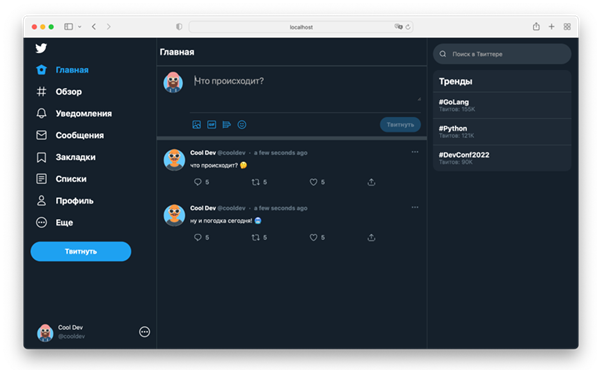
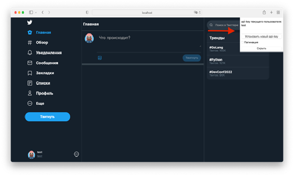
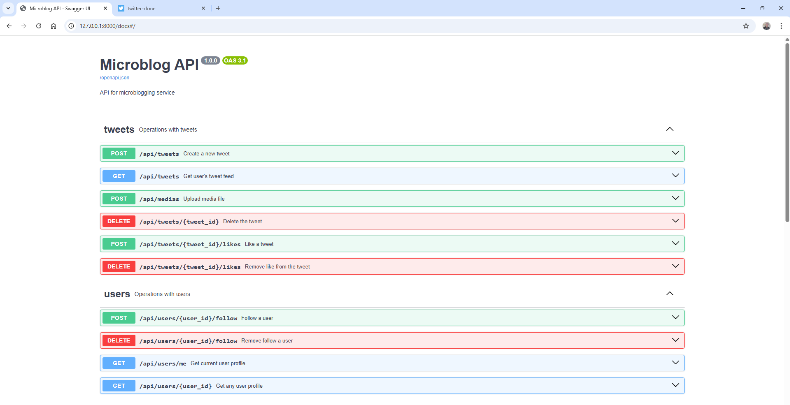

# Бэкенд к сервису микроблогов

## Описание
- Проект был создан как финальная работа по курсу «Python Advanced».
- Бэкенд приложения сервиса мокроблогов реализован с помощью Python-фреймворка FastAPI с использование СУБД PostgreSQL и удовлетворяет следующим функциональным требованиям:
  - Пользователь может добавить новый твит. 
  - Пользователь может удалить свой твит.
  - Пользователь может подписаться на другого пользователя.
  - Пользователь может отписаться от другого пользователя.
  - Пользователь может отмечать твит как понравившийся.
  - Пользователь может убрать отметку «Нравится».
  - Пользователь может получить ленту из твитов отсортированных в порядке убывания популярности от пользователей, на которых он подписан.
  - Твит может содержать картинку.

- Также API задокументирован через Swagger.


## Установка и запуск
Проект является портируемым, т.е. его можно клонировать из репозитория.

Перед запуском файл `/backend/.env.example` нужно переименовать в `/backend/.env`

Первый запуск приложения производится с помощью команды:

```
docker-compose up -d --build
```
из корневого каталога проекта. Последующие запуски можно осуществлять командой:
```
docker-compose up -d
```
При запуске приложения ключ `--build` используется в случае изменения кода, изменении файлов докера или nginx конфигурации, или файла requirements.txt.

## Использование
При запуске контейнера создается БД со сгенерированной в ней тестовой информацией:
- 5 пользователей (один из них Test User c api-key = "test");
- 10 втитов от случайных пользователей;
- 10 уникальных подписок случайных пользователей на случайных пользователей;
- 30 уникальных лайков от случайных пользователей на случайные твиты.

Тестовой данных достаточно, чтобы полностью проверить функционал приложения.

Перед запуском приложения в продакшн в файле `/backend/app/main.py` нужно убрать заполнение БД тестовыми данными:
```python 
@asynccontextmanager
async def lifespan(app: FastAPI):
    # await init_db_with_test_data()

    yield

    await engine.dispose()
```
После запуска приложения по адресу http://localhost/ можно получить фронтэнд и тестировать функционал сервиса.
<p align="center"></p>

Переключиться с тестового пользователя на другого можно с помощью этой формы (взяв предварительно api-key нового пользователя из тестовой БД).
<p align="center"></p>

По адресу http://127.0.0.1:8000/docs можно получить подробную документацию всех эндпоинтов и форматов передаваемых и получаемых сервером данных.
<p align="center"></p>

## Участники проекта
Арбузов Николай.

